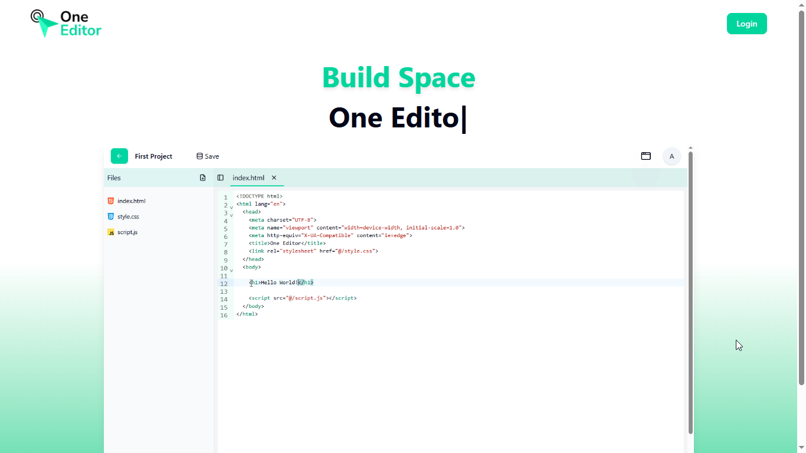
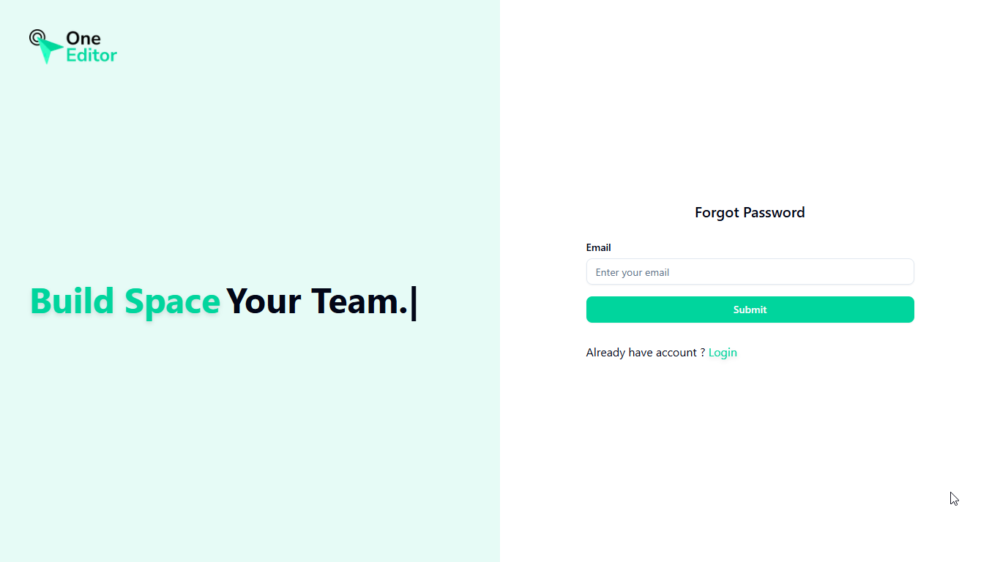
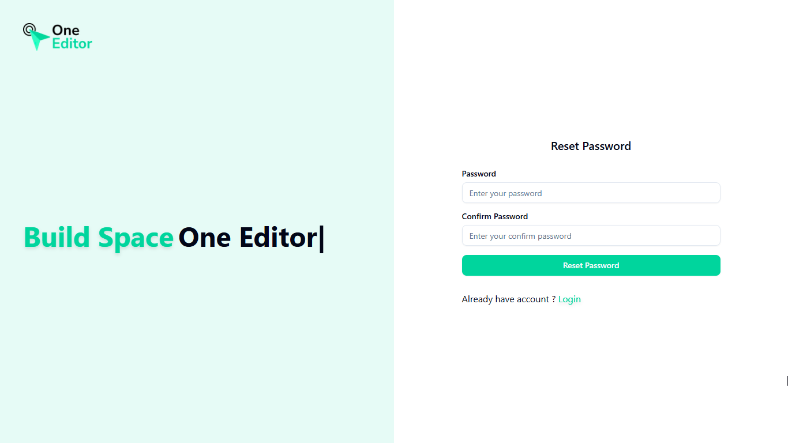
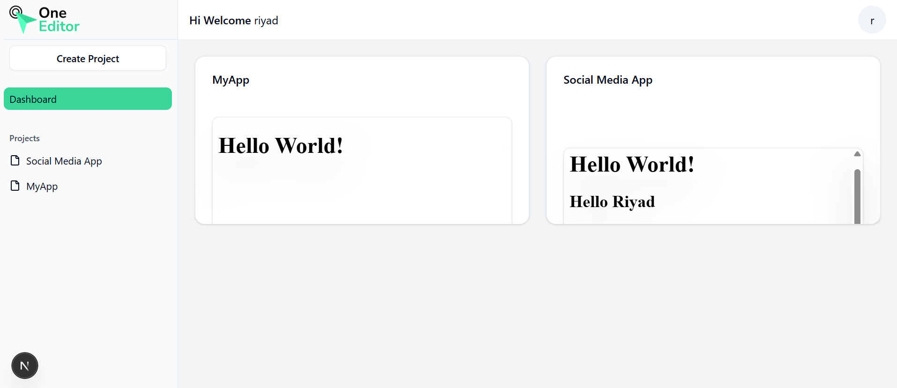
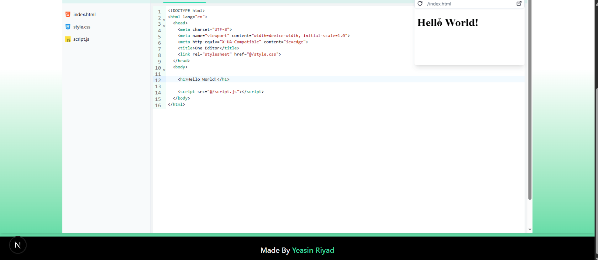
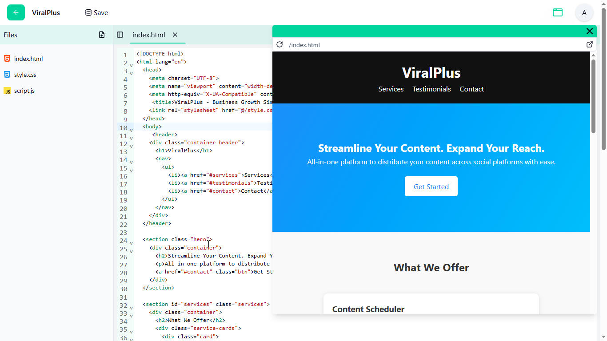

# 🚀 Online Code Editor

A powerful **online code editor** built with modern web technologies.
This project allows users to **write, run, and share code directly in the browser** with a clean and modern interface.

The platform includes **secure authentication, form validation, and real-time code execution**, making it perfect for developers, learners, and teams who want to collaborate and share code easily.

---

## ✨ Features

* 💻 **Online Code Editor** – Write and run code directly in the browser.
* 🔐 **Secure Authentication** – Sign up, login, password recovery, and email verification.
* 📝 **Form Validation** – Robust validation using Zod and React Hook Form.
* 🎨 **Modern UI** – Beautiful and responsive UI built with Tailwind CSS and Shadcn UI.
* 🔗 **Shareable Links** – Generate unique links to share code with others.
* ⚡ **Fast Performance** – Powered by modern React and Next.js architecture.

---

## 🛠️ Tech Stack

### Frontend

* **Next.js**
* **React**
* **Tailwind CSS**
* **Shadcn UI**
* **React Hook Form**
* **Zod**

### Backend

* **Node.js**
* **Next.js API Routes**

### Database

* **MongoDB**

### Authentication

* **NextAuth.js**

---

## 📸 Project Screenshots
### 💻  Home Page

### 🔐 Authentication Page

### 🔐 Authentication Page

### 🔐 Authentication Page

### 🔐 Authentication Page

### 💻 Code Editor

### 🔗 Share Code Feature

## 👨‍💻 Author

Developed with ❤️ by **Yeasin Riyad**

GitHub:
https://github.com/yeasin-riyad
